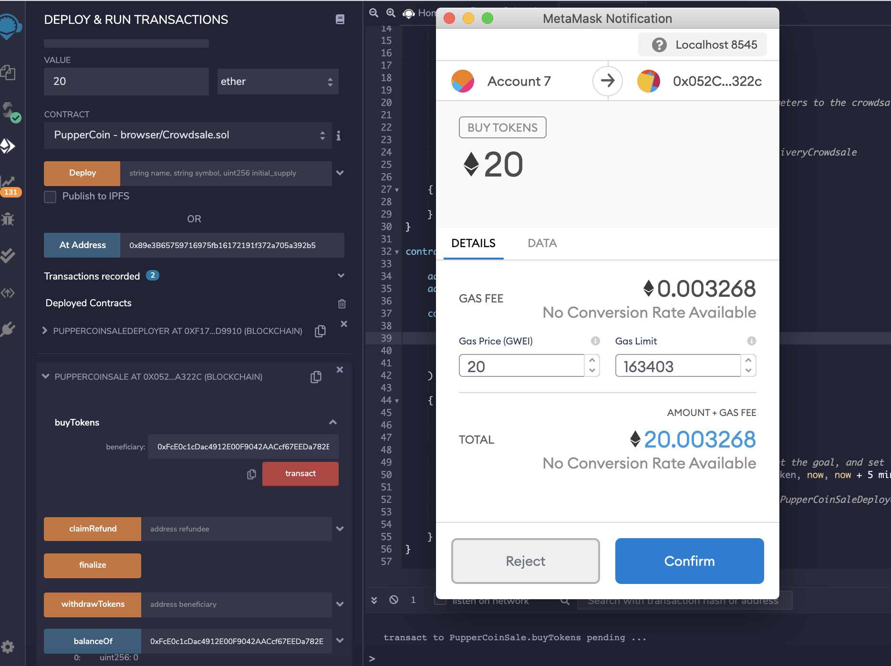
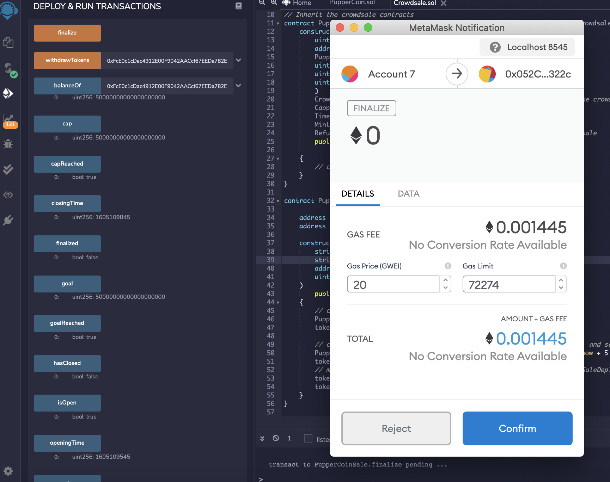

# Crowdsale using OpenZeppelin Solidity Libraries

## 1. Overview 
The purpose of this exercise is to create an ERC20 token that will be minted through a Crowdsale contract leveraged from the OpenZeppelin Solidity library.  

High-level requirements and process:
   * Crowdsale of a PupperCoin token, open to the public to fund a network development
   * Enable refunds if crowdsale is successful and goal is met
   * A maximum of 300 ether can be raised
   * the crowdsale contract will manage the entire process, allowing users to send ETH and get back PCT (PupperCoin)
   * the contract will mint the tokens automatically and distribute them to buyers in one transaction.
   * it will inherit Crowdsale, CappedCrowdsale, TimedCrowdsale, RefundableCrowdsale, and MintedCrowdsale.  

This document includes instructions and screenshots for testing locally as well as on a Kovan network.  

## 2. Contracts:
### ERC20 PupperCoin
Makes use of a standard ERC20Mintable and ERC20Detailed contract.

### PupperCoinCrowdsale
Inherits the following OpenZeppelin contracts:
   * Crowdsale
   * MintedCrowdsale
   * CappedCrowdsale
   * TimedCrowdsale
   * RefundablePostDeliveryCrowdsale

Other requirements:
   * Rate is hardcoded as 1 to maintain parity with ether units
   * use now and now + 24 weeks when passing the open and close times to set the time properly. However for testing purposes this was adjusted to 5 minutes.

### PupperCoinCrowdsaleDeployer
Which creates a token address and token sale address that is used to deploy PupperCrowdsale and PupperCoin contracts. 

## 3. Testing

### Results of testing with local deployment:
* Send Ether to the crowdsale from a different account from where the contract was deployed:  

1. For purposes of the exercise the goal was set at `50ETH` and the close-out time was set at `now + 5 minutes`

2. Metamask confirmation for contract deployment:
  
The contract was deployed with token name PupperCoin, token symbol PUP.
The address where the code was deployed on MyCrypto is: 0xAC814448D563B290C8A40c4c076307A034cC17b9

The address that bought the tokens is: 0x81080EB0235f9B0CB20ECf562e9b674d323E64D3

3. Results of 3 deployed contracts: 

4. Buy 20 tokens successfully: 

5. Balance updated post 20ETH tokens was purchased:

6. Test goal functionality by buying 40ETH tokens which exceeded the balance as expected:

7. Buy another 30ETK tokens to reach the goal of 50ETH

8. Balance, goal and WeRaised are equal at 50ETH:

9. Image before finalizing contract. CapReached being True.

10. Finalize with metamask confirmation, hasClosed is false, isOpen is true, finalized is false:

11. Updated statuses post Finalization - hasClosed is true, isOpen is false, finalized is true:
 

### Results of testing with KOVAN deployment: 

1. Deploy contracts to Kovan, with goal as 1 ETH, due to limited ETH balance on account:
  

2. Buy 500WEI tokens:

3. Confirm BalanceOf updated to 500, goal, finalized and isOpen:

4. Buy 0.09 ETH tokens to same account:

5. BalanceOf updated with additional purchase

6. Screenshots of successful token transfer on EtherScan

## 4. File Location:

### Starter code:
1. PupperCoin that creates an ERC20 token that will be minted through a Crowdsale. It utilizes the standard ERC20Mintable and ERC20Deatiled contracts:  

    [Puppercoin_starter_code](./Starter_code/PupperCoin.sol)

2. Crowdsale code that manages the entire process, allowing users to send ETH and get back PUP (PupperCoin). This contract will mint the tokens automatically and distribute them to buyers in one transaction. It will need to inherit Crowdsale, CappedCrowdsale, TimedCrowdsale, RefundableCrowdsale, and MintedCrowdsale:  

   [Crowdsale_code](./Starter_code/Crowdsale.sol)

